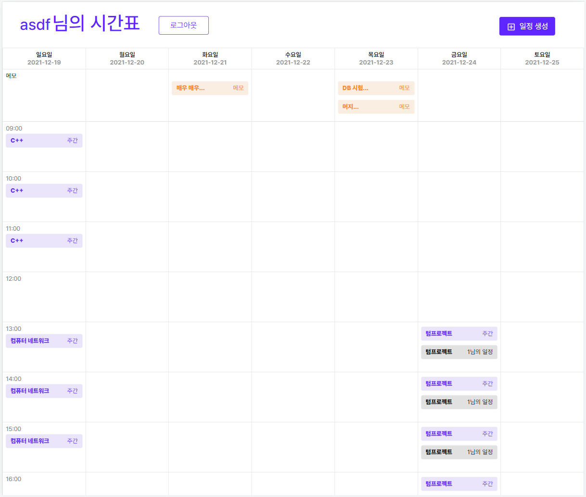

# 기말 프로젝트

## 텀프로젝트 TwT (Typical writable Timetable)
TwT 텀프로젝트 API 서버



## 시간표 API
` POST /getData `
```js
{
    "statusCode": 200,
    "success": true,	// 쿼리 처리 성공시 true
    "message": "load Data Success",
    "data": [
        [
            {
            "s_no": 1,  // 일정 번호 
            "s_user": "asdf",   // 일정의 소유자
            "s_day": 0, // 일정 요일 (0 ~ 6)
            "s_start": "13:00:00",	// 일정 시작 시간 HH:MM:00
            "s_end": "16:00:00",    // 일정 종료 시간 HH:MM:00
            "s_title": "컴퓨터 네트워크",  // 일정 제목
            "s_content": "호천관 903호",   // 일정 내용
            "s_seme": 0,    // 일정 학기 0/1 (n+1학기)
            "s_able": 0,    // 공유 가능 여부
            "s_s": 13,  // 시작 시간 HH
            "s_e": 16   // 종료 시간 HH
            }
        ],
        [
            {
            "m_no": 1,  // 메모 번호
            "m_user": "asdf",   // 메모의 소유자
            "m_date": "2021-12-16T00:00:00.000Z",   // 해당 메모 날짜 YYYY-MM-DDT00:00:00.000Z
            "m_content": "DB 시험",   // 메모 내용
            "s_able": 0     // 메모 공유 가능 여부
            } 
        ]
    ]
}
```

## 테이블

```SQL
create table PUSER ( 
    u_no INT NOT NULL AUTO_INCREMENT PRIMARY KEY, 
    u_id VARCHAR(20) UNIQUE NOT NULL,
    u_pw VARCHAR(100),
    u_token VARCHAR(200),
    u_expired VARCHAR(30));
```

```SQL
create table SCHEDULE (
    s_no INT NOT NULL AUTO_INCREMENT PRIMARY KEY,
    s_user VARCHAR(20),
    s_day INT, 
    s_start TIME,
    s_end TIME,
    s_title VARCHAR(30),
    s_content VARCHAR(200),
    s_seme INT,
    s_able BOOL DEFAULT FALSE
);
```

```SQL
create table MEMO (
    m_no INT NOT NULL AUTO_INCREMENT PRIMARY KEY,
    m_user VARCHAR(20),
    m_date DATE,
    m_content VARCHAR(200),
    s_able BOOL DEFAULT FALSE
);
```

```SQL
create table REFE ( 
    REF_no INT NOT NULL AUTO_INCREMENT PRIMARY KEY,
    REF_SCHE INT,
    REF_MEMO INT,
    REF_PEOPLE VARCHAR(20),
    FLAG INT NOT NULL
); # FLAG 0 SCHE 1 MEMO
```

<!-- 가능하면 제대로 좀 짜보고싶네 ROUTER 설정도 좀 하고 -->

## ENDPOINT

#### 로그인
`POST /login`

#### 회원가입
`POST /register`

#### 일정 작성
`POST /sche`

#### 메모 작성
`POST /memo`

#### 시간표 불러오기
`POST /getData`

#### 일정 공유하기
`POST /setRefe`


## 추후 보강 사항
- DJANGO 내의 반복생성자 사용
- 이미지화 기능 추가
- 코드 리팩토링